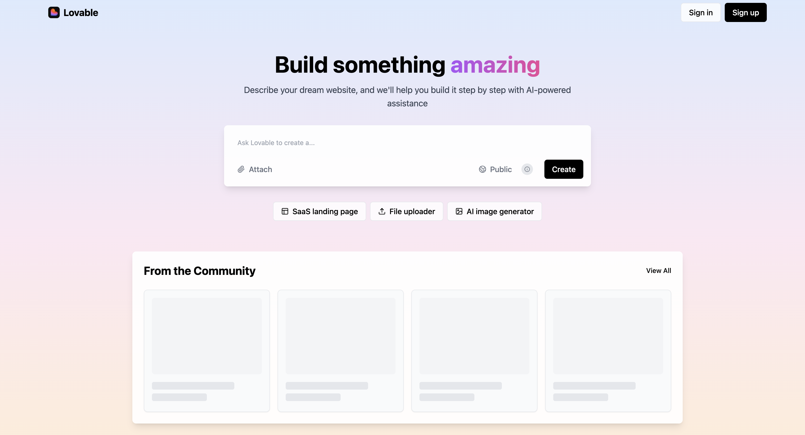
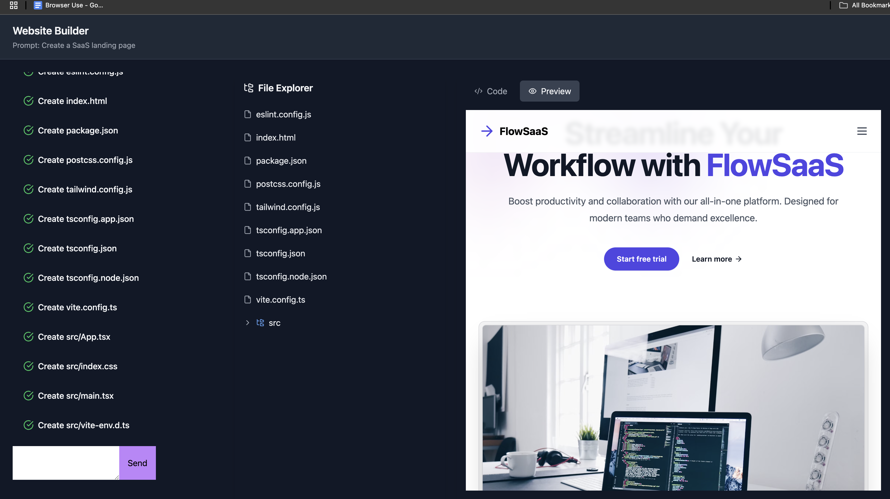
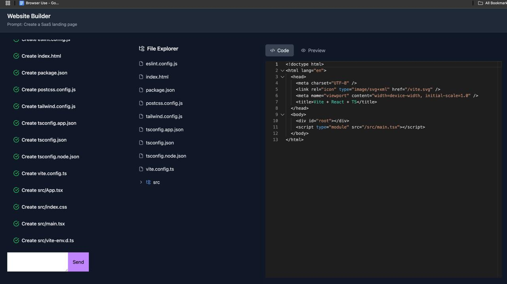

# Lovable



Build something amazing... 


*Lovable builder*


*Project file explorer and code preview*

# Lovable Clone

A modern web application built with React, TypeScript, and Vite.

## Features

- Modern UI with Tailwind CSS
- TypeScript for type safety
- Fast development with Vite
- Responsive design

## Project Structure

```
├── frontend/          # Frontend React application
│   ├── src/          # Source files
│   ├── public/       # Static assets
│   └── dist/         # Build output
└── be/               # Backend services
```

## Getting Started

### Prerequisites

- Node.js (v16 or higher)
- npm or yarn

### Installation

1. Clone the repository:
```bash
git clone https://github.com/yourusername/lovable-clone.git
cd lovable-clone
```

2. Install frontend dependencies:
```bash
cd frontend
npm install
```

3. Start the development server:
```bash
npm run dev
```

The application will be available at `http://localhost:5173`

## Development

- `npm run dev` - Start development server
- `npm run build` - Build for production
- `npm run preview` - Preview production build


## Technologies Used

- React
- TypeScript
- Vite
- Tailwind CSS
- ESLint
- PostCSS

## License

MIT 
